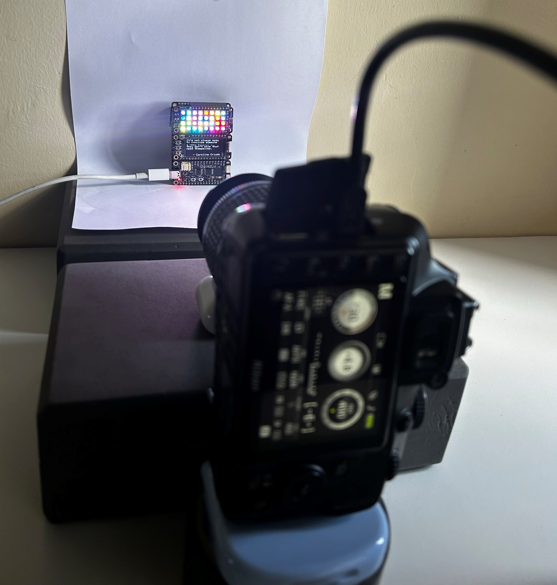
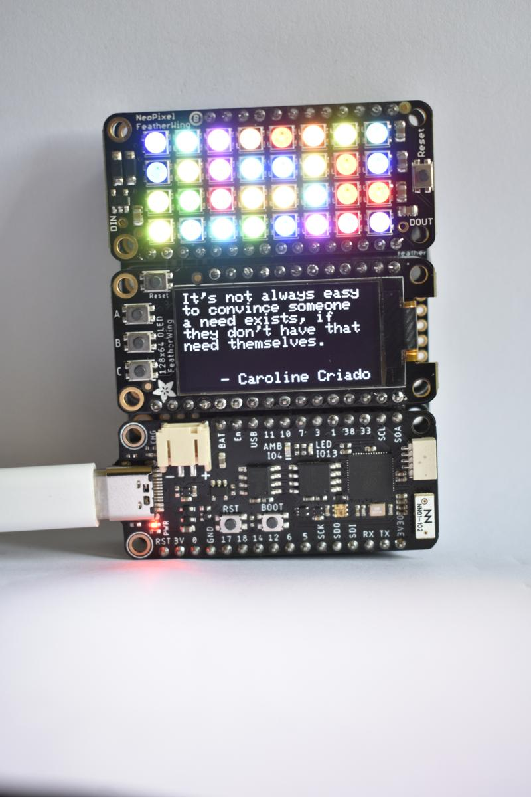
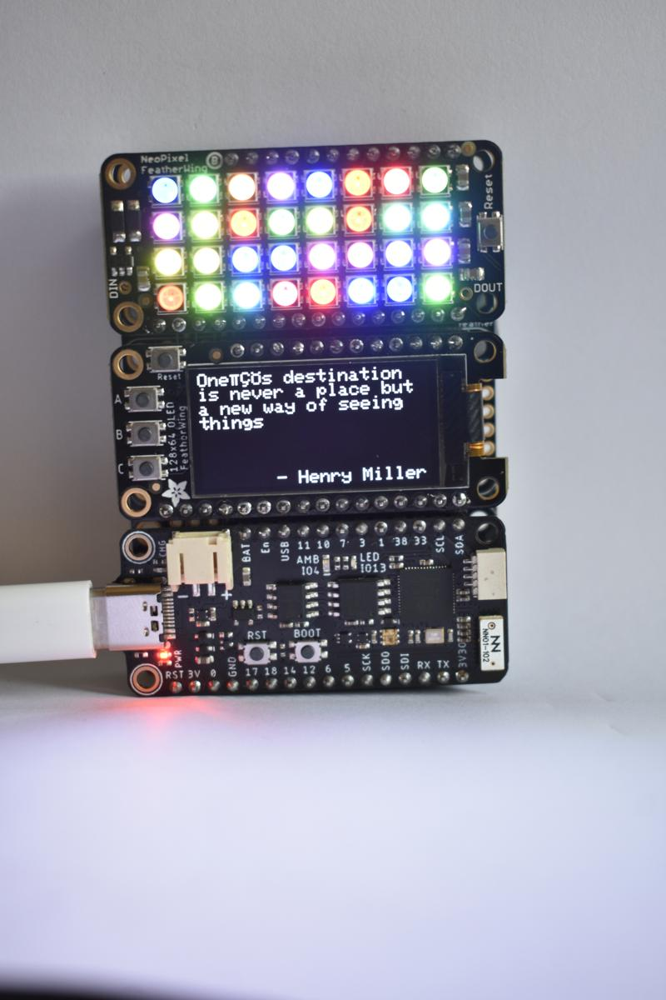
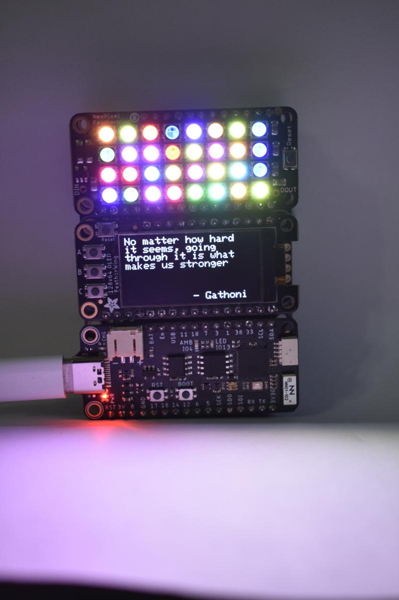
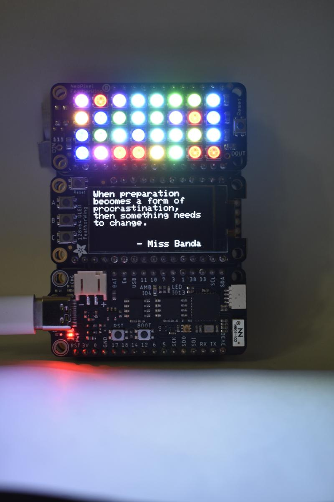
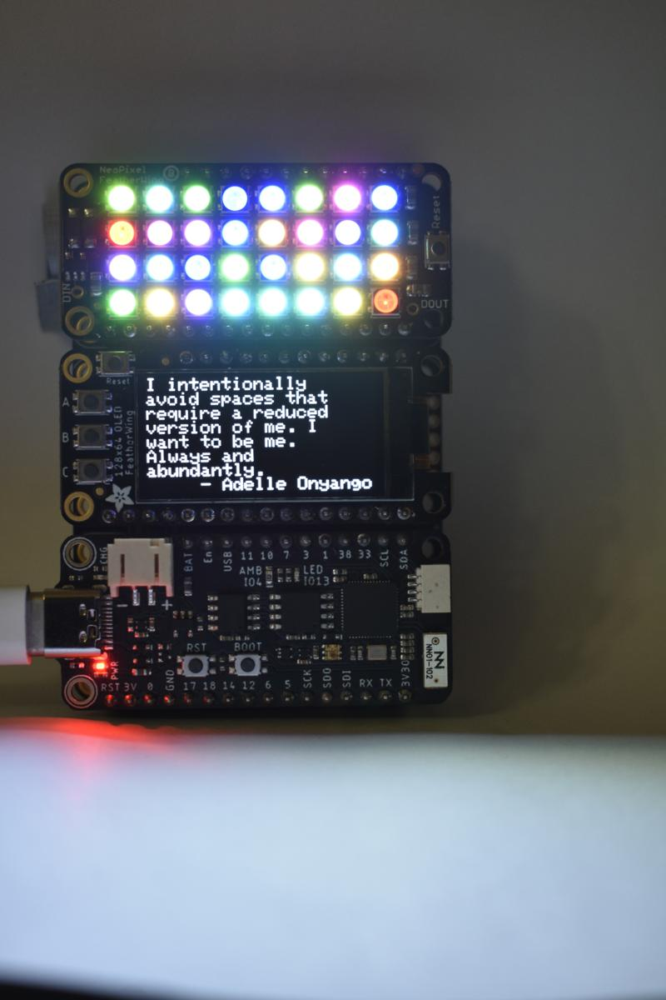

# What I Learned in 2022: An Electronics Art Project

Toward the end of 2022, while going through my stash of electronics parts to find something for work. I bumped into an [OLED display](https://www.adafruit.com/product/4650) and a [Neo Pixel](https://www.adafruit.com/product/2945) array that I've been having for quite a while but didn't quite come around to using them. I do love flashy things and art and thus the inception of this artsy project.  

The idea was to put together a setup where my friends from instagram would share some quotes or lessons they learnt throughout their year and the quotes would be displayed on the OLED display with complimenting colors from the Neopixels. [Here are the results condensed into a cool Instagram Reel](https://www.instagram.com/p/CmyOLdSpJi9/)

# How I built this
I love the How I Built this Podcast by Guy Raz and yes, I will steal that title for this section.  

  
**_"It's not always easy to convince someone a need exists, if they don't have that need themselves" - Caroline Criado_**  

To build this, I used an [ESP32-S2 board](https://www.adafruit.com/product/4769) I had because it had WiFi built in. I wrote the code in Arduino because rewriting all the drivers was reinventing the wheel. However, I still find that writing software for hardware like this is always easier in `C`. I was a bit gung ho about the project and I elected not to unit test my work especially because I had to import lots of libraries that weren't my own. Nevertheless, baring a few changes I had to make in the GFX library, all the libraries worked quite well. [Code Share here](Add code here)  

  
**_"One's destination is never a place but a new way of seeing things" - Henry Miller_**
  
On my Instagram stories, I invited my friends to share their lessons from 2022 via a short [google Form](https://docs.google.com/forms/d/e/1FAIpQLSdTJvO71LpXdyaxj3Lt5LqMGw0PWP3oRrIJ_DPpFLjc5ctxsg/viewform). The quotes would be logged onto a `google sheets` which I used as a staging point for the system. I then wrote a [Google Sheets App](Code.gs) to manage HTTP requests to and from the spreadsheet.  

  
**_"No Matter how hard it seems, going through it is what makes us stronger" - Gathoni_**
  

The ESP32 would first detect any new lesson. It would fetch the new lesson via a simple Get and the name of the person who made the quote/lesson. the ESP32 would then display the quote and name on the OLED display then generate 32 different colors to show on the NeoPixel array. I used `SHA256` encryption from each quote to generate unique color brightness for the red, green and blue lights in each NeoPixel. Once the Lesson/quote was displayed successfully, the ESP32 would mark the quote on the sheet as showing.  

  
**_"When preparation becomes a form of procrastination, then something needs to change" - Miss Banda_**
  

I then wrote a [python scrypt](lessons_from_22.py) using the `Gphoto2` library to control a `DSLR camera`. The script would check the google sheets for which Lesson/quote was showing then take a picture of the setup. I hooked in the `instagrapi` library to subsequently upload the picture just taken to my instagram stories after preprocessing it using `pillow` library. This script can run on any internet connected Raspberry Pi. After the post was made successfully, the quote would be marked as posted then the ESP32 would move on to the next new lesson. 

  
**_"I intentionally avoid spaces that require a reduced version of me. I want to be me. Always and abanduntly" - Adelle Onyango_**

# Things I Could have Done Better
1. I could have totally benefited from Unit Testing My code. But I also feel like this would be reasonable only if I intended for sale. #NotMissionCritical. 
2. Better Error Handling especially for the `Gphoto2` suite. 
3. Better photography setup. I learnt a lot about shutter speed, ISO and aperture control while building this. I will definitely use the lessons from here for other future project.
4. Handle special character on the OLED better. I totally did not foresee names with special characters. I also didn't know there was a different single quote depending on what phone you use. 

**_I hope to do more electronics art projects in 2023 and I'd love new Ideas._**